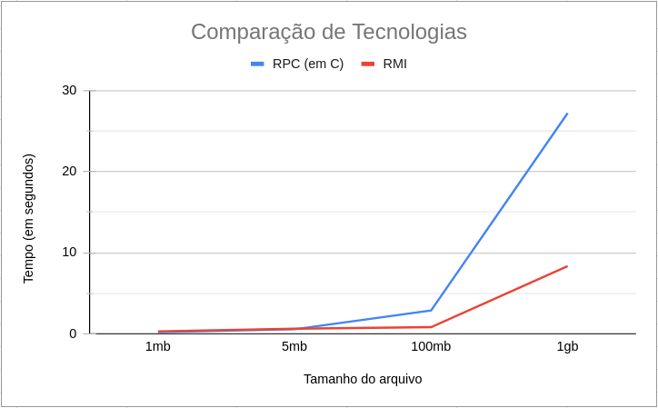

# rpc-and-rmi
en-US: A file transfer system, using RPC in C language and RMI in Java

PT-BR: Um sistema de transferência de arquivo, usando RPC na linguagem C e RMI em Java

## RPC (Remote Procedure Call)

Para executar o projeto, primeiro é necessário instalar suas dependências:
```bash
apt install libtirpc-dev libtirpc-common libtirpc3 libntirpc3.5 rpcbind
``` 

- Em seguida, é necessário executar o passo a passo **na ordem descrita**:

1. Execute o rpcbind como root: `sudo rpcbind`;

1. Entre na pasta /rpc;

2. Execute `make`;

3. Ainda na **na pasta /rpc**, execute `bin/server`;

4. Executar `bin/client <host> <nome_do_arquivo>`, substituindo <host> pelo endereco do host e <nome_do_arquivo> pelo nome de um arquivo que esteja na pasta /rpc. Para testes simples, um arquivo *text.txt* foi providenciado.

Caso possua algum erro de permissões ao executar `bin/server` ou `bin/client`, use `chmod +x` nos dois arquivos para transformá-los em executáveis. Exemplo:

```bash
chmod +x ./bin/server
chmod +x ./bin/client
```


## RMI (Remote Method Invocation)

- Para compilar os arquivos java, use o comando: 
`javac uploadRmi/Upload.java uploadRmi/Server.java uploadRmi/Client.java` 
de dentro da pasta /rmi

- Para executar o projeto, é necessário três passos **na ordem descrita**:

1. Entre na pasta /rmi;

2. Executar `rmiregistry` **na pasta /rmi**;

3. Executar `java uploadRmi.Server`;

4. Executar `java uploadRmi.Client <nome_do_arquivo> <host>`, substituindo <nome_do_arquivo> pelo nome de um arquivo que esteja na pasta rmi e <host> pelo endereco do host. Para testes simples, um arquivo *text.txt* foi providenciado.


## Script para gerar arquivos de tamanhos específicos:

```bash
touch file-1gb file-100mb file-5mb file-1mb
shred -n 1 -s 1G file-1gb
shred -n 1 -s 100M file-100mb
shred -n 1 -s 5M file-5mb
shred -n 1 -s 1M file-1mb
```

## Comparação entre as tecnologias

Foi feito uma comparação com entre o upload de arquivos de 1gb, 100mb, 5mb e 1mb entre as duas tecnologias. A média dos resultados pode ser mostrada pelo gráfico a seguir:

<p align="center">
  
</p>

No qual a linha em vermelho representa a média dos uploads feitos em RMI e a linha azul a média dos uploads feito em RPC. O RMI demonstra ser mais rápido e estável que o RPC para arquivos grandes.